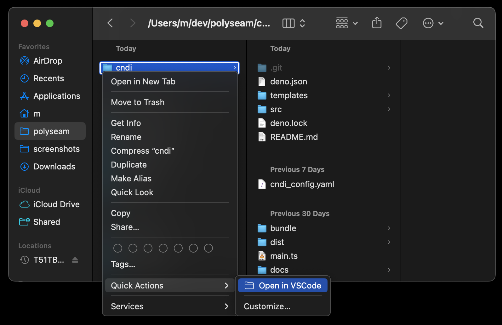

# Open in VSCode

VSCode does not enable opening folders from the macOS context menu (ctrl-click),
this package does!

## Installation

1. First make sure 'code' is added to your PATH

2. run `npx install-open-in-vscode`
3. ensure that the option is enabled under
   `System Settings.app/General/Login Items and Extensions/Finder`

## Usage

If the option is not immediately in the context menu, it is likely under
`Services` or `Quick Actions`
